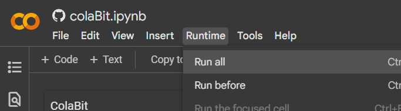
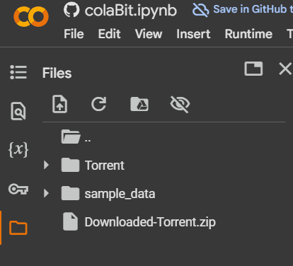

<div align="center">

```
   ______      __      ____  _ __ 
  / ____/___  / /___ _/ __ )(_) /_
 / /   / __ \/ / __ `/ __  / / __/
/ /___/ /_/ / / /_/ / /_/ / / /_  
\____/\____/_/\__,_/_____/_/\__/  
```

# colaBit-Torrent

Your Google Colab-Based Cloud Torrent Downloader

[](https://colab.research.google.com/github/Avil-XD/colaBit-torrent/blob/master/colaBit.ipynb)

</div>

---

> Transform your browser into a powerful torrent downloader using Google's infrastructure. Download at high speeds with up to 350GB (Maximum on GPU Runtime) of cloud storage - no installation needed!

## ⚡ Purpose
```
✦ Download torrent files where torrent downloading is restricted.
✦ Make use of google servers download speed.
✦ No installation of torrent softwares.
✦ You only need a browser.
```
## ⚡ Key Features

```
┌──────────────────────────────── 
│ POWER CAPABILITIES                     
├────────────────────────────────         
│ ✦ Google Server-Speed Downloads        
│ ✦ Up to 350GB Cloud Storage(GPU)       
│ ✦ Pure Browser Operation              
│ ✦ Parallel Download Support             
│ ✦ Auto File Compression         
└────────────────────────────────
```
## 🚀 Usage Guide

### 1. Launch
<a href="https://colab.research.google.com/github/pollmix/google-colab-torrent-downloader/blob/master/torrent.ipynb" target="_parent"></a>
```
➜ Click "Open in Colab" above 

➜ Start Runtime --> Run All (Restart any failed cell manually if error occurs)
```



### 2. Input

>Enter the magnet/.torrent file Link and press enter


```
Supports:
✓ Magnet links
✓ .torrent file URLs (auto-converts to magnet)
```

### 3. Download Process
```python
# Progress info shown:
- Download percentage
- Speed (up/down KB/s)

After Completion --> Zip the torrent download (Run zipping cell)
After Zipping --> Download Zip File from folders on left

```


## 🚀 Technical Stack

```python
# Core Dependencies
LIBRARIES = {
    'libtorrent': 'Primary torrent handler',
    'wget': 'Torrent file downloader',
    'torf': 'Torrent processing',
    'zipfile': 'Auto compression'
}

# Download Configuration
STORAGE_PATH = '/content/Torrent/'
OUTPUT_FILE = 'Downloaded-Torrent.zip'
PORTS = range(6881, 6891)
```

## 📦 Dependencies
The notebook automatically installs all required dependencies:

```bash
# System Dependencies
$ apt install python3-libtorrent

# Python Packages
$ pip install --upgrade pip setuptools wheel
$ pip install lbry-libtorrent wget torf
```


## 💾 Storage Options

```python
# Available Modes:
BASIC = "80GB"    # Default mode
PRO = "350GB"     # With GPU runtime

# Enable PRO mode:
1. Runtime > Change runtime type
2. Hardware accelerator > GPU
3. Save
```

## ⚡ Advanced Features

```
[SYSTEM CAPABILITIES]
├── 🔄 Parallel downloading
├── 🎯 DHT network enabled
├── 🔄 Auto magnet conversion
├── 📊 Real-time progress tracking
└── 🗜️ Automatic ZIP compression
```

## ⚠️ Troubleshooting

```
[COMMON SOLUTIONS]
┌────────────────┬────────────────────
│ Issue          │ Fix               
├────────────────┼────────────────────
│ Slow Speed     │ Check peer count  │
│ Space Full     │ Enable GPU mode   │
│ Metadata Stuck │ Allow completion  │
│ ZIP Error      │ Check free space  │
└────────────────┴────────────────────
```

## 📜 License

```
[MIT LICENSE]
├── ✅ Free to use and modify
├── 📄 Include license notice
└── ⚖️ No liability
```

## 🛡️ Usage Guidelines

```
[SAFETY RULES]
├── ✅ Respect Colab terms
└── 🛡️ Use responsibly
```
