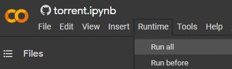
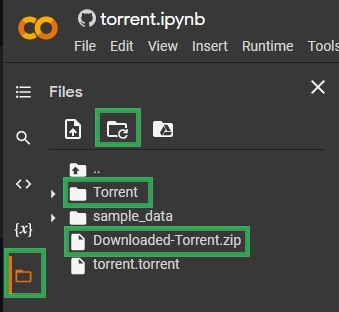
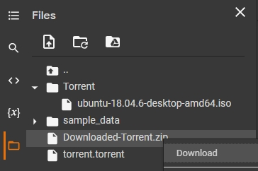
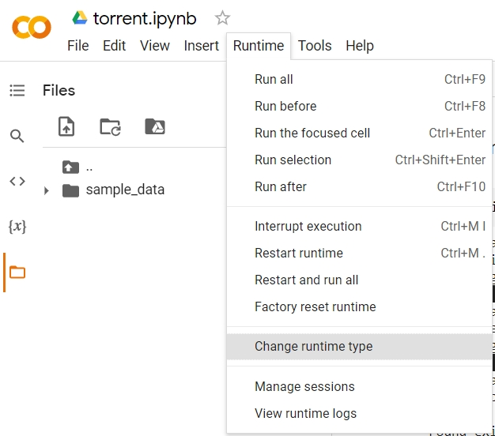
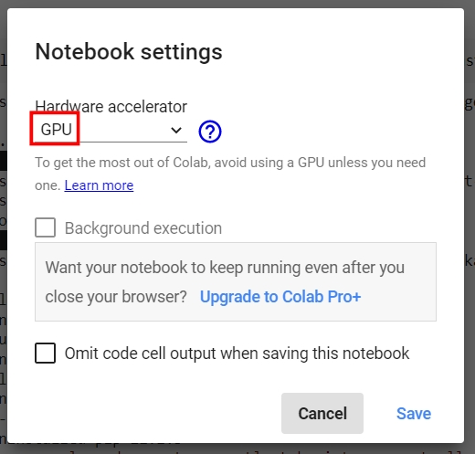

# 🌩️ colaBit-torrent

```
   ______      __      ____  _ __ 
  / ____/___  / /___ _/ __ )(_) /_
 / /   / __ \/ / __ `/ __  / / __/
/ /___/ /_/ / / /_/ / /_/ / / /_  
\____/\____/_/\__,_/_____/_/\__/  
                                  
Transform Google Colab into Your Personal Cloud Downloader
```

[](https://colab.research.google.com/github/Avil-XD/colaBit-torrent/blob/master/ColabTorrentDownloader.ipynb)
[](https://github.com/Avil-XD/colaBit-torrent/blob/master/LICENSE)
[](https://github.com/Avil-XD/colaBit-torrent/stargazers)
[](https://github.com/Avil-XD/colaBit-torrent/network)
[](https://github.com/Avil-XD/colaBit-torrent/issues)

> 🚀 Harness the power of Google's infrastructure for lightning-fast downloads, all through your browser.

## 💫 Why colaBit-torrent?


### 🎯 Key Benefits

| Feature | Traditional Clients | colaBit-torrent |
|---------|-------------------|----------------|
| Download Speed | Limited by ISP | Google Server Speed |
| Storage Space | Local Disk | Up to 350GB Cloud |
| Installation | Required | None |
| Privacy | Local Exposure | Cloud-based |
| Cross-platform | OS Dependent | Browser Only |

## 🌟 Features

### Core Features
- 🚀 Parallel Download Support
- 💻 Pure Browser Experience
- 📦 Massive Storage (up to 350GB)
- ⚡ DHT Network Support
- 🗜️ Automatic File Compression

### Technical Features
- 🔄 Magnet & Torrent File Support
- 📊 Real-time Progress Tracking
- 🔍 Metadata Handling
- 📱 Mobile Compatibility
- 🔒 Sequential/Parallel Options

## 🛠️ Technical Stack

### Core Libraries
- `libtorrent`: Primary torrent handling
- `wget`: Torrent file downloading
- `torf`: Torrent file processing
- `zipfile`: File compression

### Storage
- Default Path: `/content/Torrent/`
- Compressed Output: `Downloaded-Torrent.zip`
- Parallel Download Mode

## 🎮 Quick Start

### 1️⃣ Launch
Click the `Open in Colab` badge to start your journey.

### 2️⃣ Setup Environment

The notebook automatically installs all required dependencies.

### 3️⃣ Input Link

Support for both:
- Magnet links
- .torrent file URLs

### 4️⃣ Monitor Progress

Real-time updates showing:
- Download percentage
- Speed (up/down)
- Peer count
- Current state

### 5️⃣ Get Files

Download options:
- Compressed ZIP file
- Individual file selection

## ⚡ Power User Tips

### Storage Optimization
```python
# Default: 80GB
Basic_Path = '/content/Torrent/'
# Upgraded: 350GB
Pro_Path = '/content/Torrent/'  # with GPU Runtime
```

For maximum storage:



### Performance Tweaks
- Parallel downloading enabled
- DHT network utilized
- Automatic metadata handling
- Real-time status monitoring

## 🛡️ Best Practices

### Input Handling
- Both magnet links and .torrent URLs supported
- Automatic conversion of .torrent to magnet
- Progress tracking with states:
  - Queued
  - Checking
  - Downloading metadata
  - Downloading
  - Finished
  - Seeding
  - Allocating

### Output Management
- Automatic ZIP compression
- Organized file structure
- Progress percentage display
- Upload/Download speed monitoring
- Peer connection tracking

## 🔧 Troubleshooting Guide

### Common Issues
| Issue | Solution |
|-------|----------|
| Metadata Download | Wait for completion |
| Slow Speed | Check peer count |
| Space Issues | Switch to GPU runtime |
| File Access | Check zip completion |

### Status Codes
```python
state_str = [
    'queued',
    'checking',
    'downloading metadata',
    'downloading',
    'finished',
    'seeding',
    'allocating'
]
```

## 📘 FAQ

### General Questions
- **Q: What files can I download?**
  - A: Both magnet links and .torrent files supported
  
- **Q: How is progress shown?**
  - A: Real-time updates with percentage and speed
  
- **Q: Where are files saved?**
  - A: In `/content/Torrent/` and compressed as `Downloaded-Torrent.zip`

### Technical Questions
- **Q: Download mode?**
  - A: Parallel downloading for optimal speed
  
- **Q: Network protocol?**
  - A: Uses DHT network and libtorrent

## 🤝 Community & Contributing

### Ways to Contribute
1. 🌟 Star the repository
2. 🐛 Report issues
3. 💡 Suggest features
4. 🔧 Submit PRs

### Development Focus
- Speed optimization
- Storage efficiency
- User experience
- Error handling

## 📜 License & Legal

### MIT License
This project is licensed under MIT - see [LICENSE](LICENSE)

### Legal Usage
- Respect copyright
- Follow ToS
- Use responsibly

## 🙏 Acknowledgments

### Libraries
- libtorrent
- wget
- torf
- Python standard library

### Infrastructure
- Google Colab
- Python ecosystem
- Open source community

---

<div align="center">
  
### Made with ❤️ by the Community

[Report Bug](https://github.com/Avil-XD/colaBit-torrent/issues) · [Request Feature](https://github.com/Avil-XD/colaBit-torrent/issues) · [Join Discussion](https://github.com/Avil-XD/colaBit-torrent/discussions)

</div>
